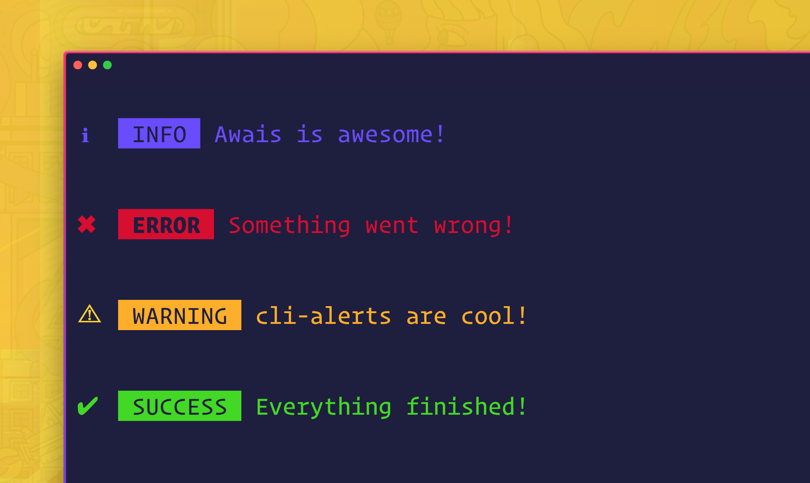

# Alerting 

***
### packages for alerting 

 - [cli-alerts](https://www.npmjs.com/package/cli-alerts)

 Cross platform CLI Alerts with colors & colored symbols for success, info, warning, error. Work on macOS, Linux, and Windows.

 
 - [Beeper](https://www.npmjs.com/package/beeper)

 Useful as an attention grabber. For example, when an error happens.

 

 - [sweetalert](https://www.npmjs.com/package/sweetalert2)

A beautiful, responsive, customizable, accessible (WAI-ARIA) replacement for JavaScript's popup boxes. Zero dependencies.

